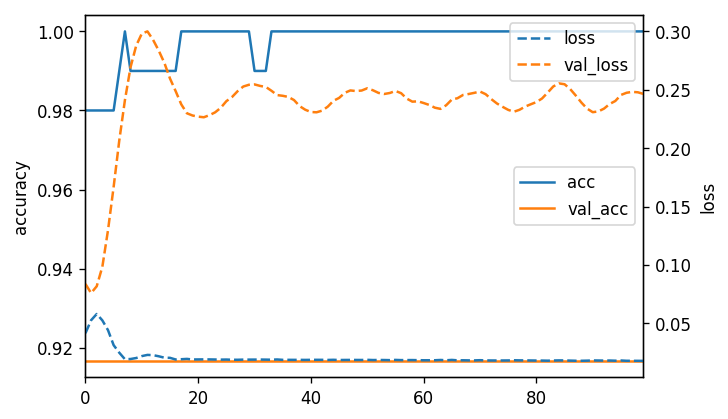
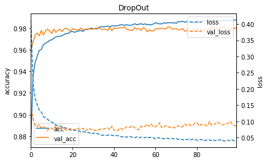
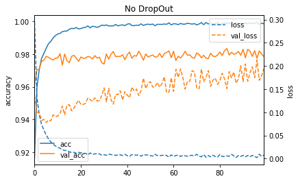
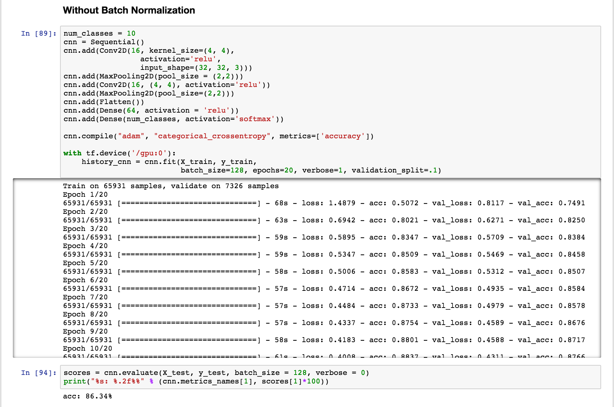
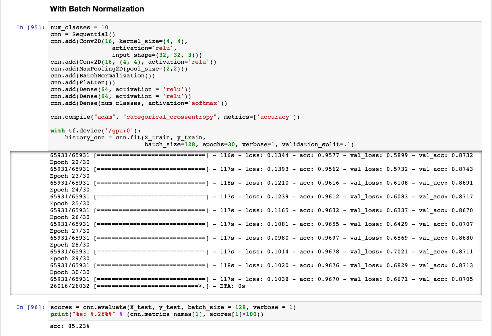
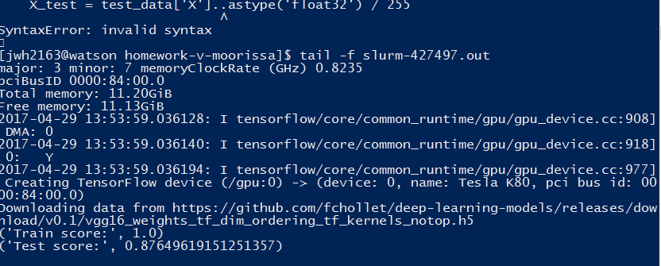

# Deep Learning with Keras
Moorissa Tjokro

## Overview
I will be using the [Keras Sequential Interface](https://keras.io/getting-started/sequential-model-guide/) and the following datasets to run two multilayer perceptron models and two convolutional neural network models for building models:
* Iris
* MNIST
* SVHN
* Pets dataset with a variety of dog types.

## Tasks
*Codes can be found in github folders*

### Task 1
The first model is built using a multilayer perceptron (feed forward neural network) with two hidden layers and rectified linear nonlinearities on the iris dataset. The model is then selected on an independent test-set.

#### Evaluation
* Test loss score: 0.121
* Test accuracy score: 0.974

### Task 2
The second model is built using a multilayer perceptron on the MNIST dataset. The “vanilla” model is then compared with a model using drop-out to see if there is any improvements. The scoring evaluation and result visualization of the learning curves can be found below:

#### Model with No Dropout
* Test loss for No Dropout: 0.237
* Test Accuracy for No Dropout: 0.975

#### Model with Dropout
* Test loss for Dropout: 0.119
* Test Accuracy for Dropout: 0.976

#### Learning curves between drop out and no dropout:

### Task 3
The third model uses convolutional neural network on the SVHN dataset using a single digit classification. The model is built using batch normalization, which will then be compared with other approaches.

#### Base model without Batch Normalization
* Accuracy on test set: 86.34%

#### Base model with Batch Normalization
* Accuracy on test set: 85.23%

### Task 4
The next dataset will be the largest in size, as we will be working with the 37 class classification task using [pets dataset](http://www.robots.ox.ac.uk/~vgg/data/pets/). The weights of a pre-trained convolutional neural network like AlexNet or VGG will be used for feature extraction and linear modeling. The weights are then loaded into keras and features are computed using a forward pass to be then stored in disk. Then a linear model or MLP will be trained on the resulting features.

* Accuracy score on test set: 0.8765

